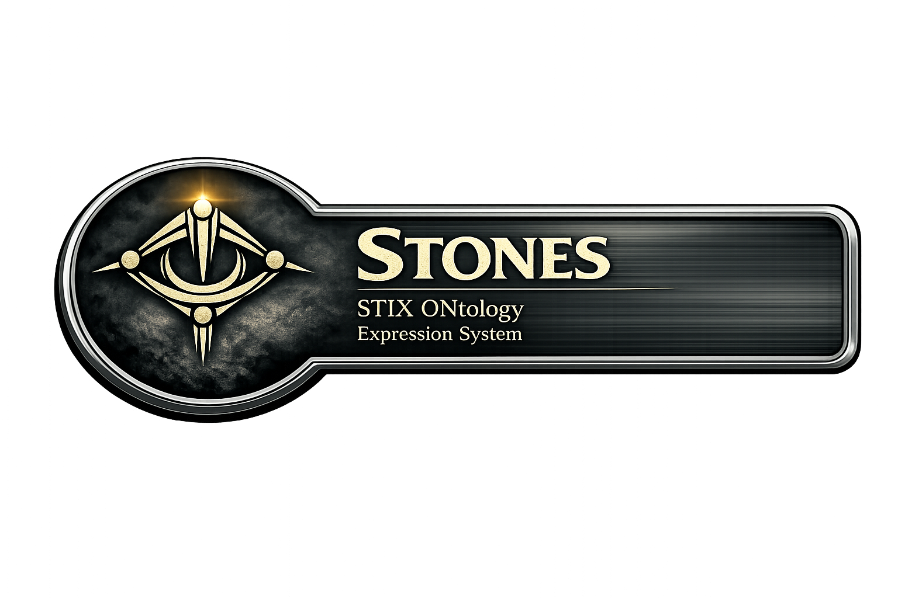

# STONES — STIX ONtology Expression System

**STONES is an OWL 2 ontology that gives STIX 2.1 formal semantics.**

STIX 2.1 is the OASIS standard for representing and sharing cyber threat intelligence. It is widely used, richly detailed, and entirely non-ontological — a JSON schema whose semantics live in prose, not in a machine-interpretable model. STONES changes that. Every STIX 2.1 domain object, observable, and relationship type is represented as a named OWL class or property, preserving the meaning of the specification while enabling SPARQL querying, OWL reasoning, and knowledge graph integration.

STONES is independent work. It is not affiliated with OASIS or the OASIS Cyber Threat Intelligence Technical Committee (CTI-TC).

> STONES is a candidate ontology for the **Cyber Ontology Foundry**, announced at STIDS 2026.

---

## Status

**v0.1.0 — Active Development**

The core class hierarchy and namespace (`https://cyberterrain.org/ns/stones#`) are stable and will not change. Coverage tracks the STIX 2.1 specification. Axiomatics and edge-case modeling are under ongoing refinement. Feedback, issues, and contributions are welcome.

---

## What STONES enables

- **SPARQL queries** across STIX-structured threat intelligence data
- **OWL reasoning** over CTI — infer relationships, classify instances, detect inconsistencies
- **Knowledge graph integration** — connect STIX data to other ontologies and enterprise knowledge systems
- **Semantic interoperability** — a shared formal model that transcends tool-specific JSON representations

---

## Quick Start — Using the Ontology

### 1. Download

Download the single-file ontology:

```
ontologies/stones-merged.ttl
```

Or clone the full repository (see Developer Setup below).

### 2. Load into a triplestore

Load `stones-merged.ttl` into any OWL-compatible triplestore:
[AllegroGraph](https://allegrograph.com) · [Stardog](https://stardog.com) · [GraphDB](https://graphdb.ontotext.com) · [Apache Jena / Fuseki](https://jena.apache.org)

### 3. Verify with SPARQL

```sparql
PREFIX stones: <https://cyberterrain.org/ns/stones#>
PREFIX owl:    <http://www.w3.org/2002/07/owl#>
PREFIX rdfs:   <http://www.w3.org/2000/01/rdf-schema#>

SELECT ?class ?label WHERE {
  ?class a owl:Class ;
         rdfs:label ?label .
}
ORDER BY ?label
```

This returns all STIX 2.1 domain object classes with their labels — confirming the ontology loaded correctly.

### 4. Go deeper

Load your STIX 2.1 data alongside STONES and query across both. See the worked examples and full documentation at [cyberterrain.org](https://cyberterrain.org).

---

## Developer Setup

### Clone the repository

```bash
git clone https://github.com/Cyber-Terrain-Ontology/stones.git
cd stones
```

### Activate the pre-commit hook

Run once after cloning to enable the pre-commit hook (strips Protégé's default prefix from `.ttl` files and keeps the ontology catalog read-only):

```bash
git config core.hooksPath .githooks
```

---

## Documentation

| Resource | URL |
|---|---|
| Website | [cyberterrain.org](https://cyberterrain.org) |
| Ontology reference (WIDOCO) | [cyberterrain.org/ns/stones/doc](https://cyberterrain.org/ns/stones/doc/) |
| Namespace | `https://cyberterrain.org/ns/stones#` |
| Extension ontology | [STONEWORK](https://github.com/Cyber-Terrain-Ontology/stonework) |

---

## Ecosystem

**STONES + STONEWORK** form a composable semantic stack for AI-driven CTI analysis:

- **STONES** — faithful OWL 2 binding of STIX 2.1 *(this repository)*
- **STONEWORK** — extends STONES with MITRE ATT&CK, D3FEND, CWE, NIST SP 800-53, and CIS Critical Controls

Both ontologies are candidate submissions to the **Cyber Ontology Foundry**, alongside MITRE's D3FEND Framework Ontology.

---

## Adopters

*Using STONES in a project or product? Open an issue or pull request to be listed here.*

---

## License

STONES is released under the **MIT License** — free to use, extend, and integrate in both open-source and commercial environments. See [LICENSE](LICENSE) for full terms.
